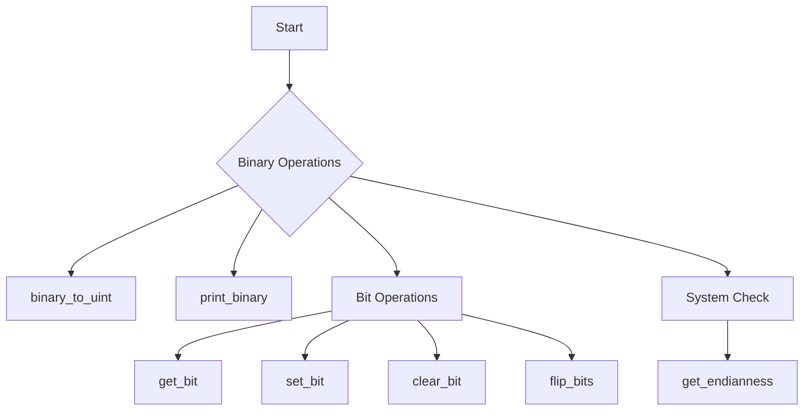

# C - Bit Manipulation

This project focuses on bit manipulation operations in C programming language. It includes various functions to perform binary operations, check endianness, and work with bits at a low level.

## Author
* **Frédéric Bourouliou**

## Project Structure

### Functions
* `binary_to_uint` - Converts a binary number to an unsigned int
* `print_binary` - Prints the binary representation of a number
* `get_bit` - Returns the value of a bit at a given index
* `set_bit` - Sets the value of a bit to 1 at a given index
* `clear_bit` - Sets the value of a bit to 0 at a given index
* `flip_bits` - Returns the number of bits needed to flip to get from one number to another
* `get_endianness` - Checks the endianness of the system

### Files Description
* `0-binary_to_uint.c`: Function that converts a binary number to an unsigned int
* `1-print_binary.c`: Function that prints the binary representation of a number
* `2-get_bit.c`: Function that returns the value of a bit at a given index
* `3-set_bit.c`: Function that sets the value of a bit to 1 at a given index
* `4-clear_bit.c`: Function that sets the value of a bit to 0 at a given index
* `5-flip_bits.c`: Function that returns the number of bits needed to flip
* `100-get_endianness.c`: Function that checks if a machine is little endian or big endian
* `101-password`: Contains password for crackme3 program
* `main.h`: Header file containing all function prototypes

## Flowchart


## Requirements
* All files are compiled on Ubuntu 20.04 LTS using `gcc`
* Code follows the Betty style
* No global variables allowed
* Maximum of 5 functions per file
* Only allowed C standard library functions are `malloc`, `free`, and `exit`

## Compilation
All files are compiled using:
```bash
gcc -Wall -Werror -Wextra -pedantic -std=gnu89
```

## Usage Example
```c
int main(void)
{
    unsigned int n;

    n = binary_to_uint("1100010");
    printf("%u\n", n);
    return (0);
}
```