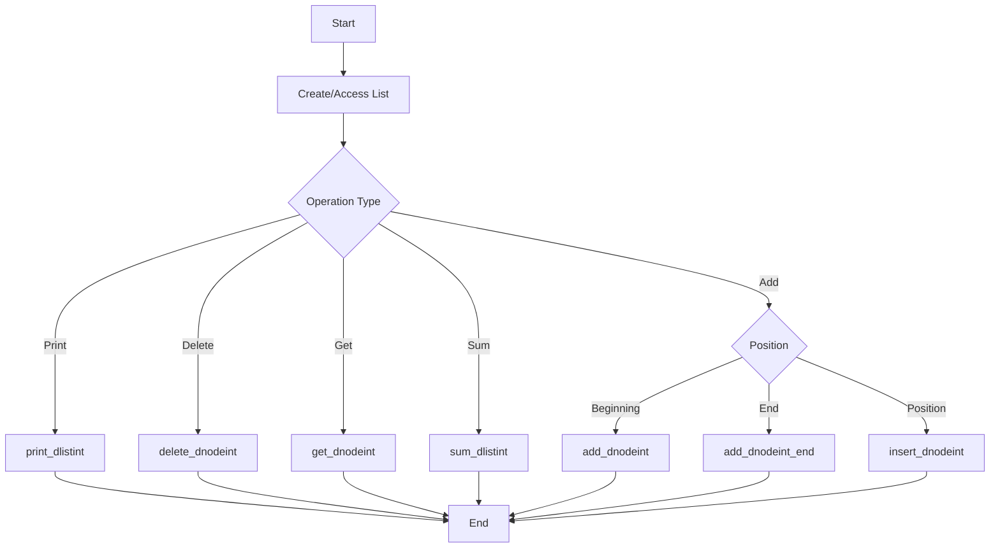

# C - Doubly Linked Lists

## Description
This project is part of the Holberton School curriculum and focuses on implementing and manipulating doubly linked lists in C. A doubly linked list is a data structure that consists of nodes where each node contains a data field and two references (links) that point to the next and previous nodes in the sequence.

## Files Description
* `lists.h` - Header file containing all function prototypes and the structure definition for doubly linked list
* `0-print_dlistint.c` - Function that prints all elements of a doubly linked list
* `1-dlistint_len.c` - Function that returns the number of elements in a doubly linked list
* `2-add_dnodeint.c` - Function that adds a new node at the beginning of a doubly linked list
* `3-add_dnodeint_end.c` - Function that adds a new node at the end of a doubly linked list
* `4-free_dlistint.c` - Function that frees a doubly linked list
* `5-get_dnodeint.c` - Function that returns the nth node of a doubly linked list
* `6-sum_dlistint.c` - Function that returns the sum of all the data (n) of a doubly linked list
* `7-insert_dnodeint.c` - Function that inserts a new node at a given position
* `8-delete_dnodeint.c` - Function that deletes the node at index of a doubly linked list

### Advanced Tasks
* `100-password` - Password for crackme4 program
* `102-result` - The largest palindrome made from the product of two 3-digit numbers
* `103-keygen.c` - Keygen for crackme5 program

## Flowchart

## Author
* **Frédéric Bourouliou** - [Github](https://github.com/fbourouliou)