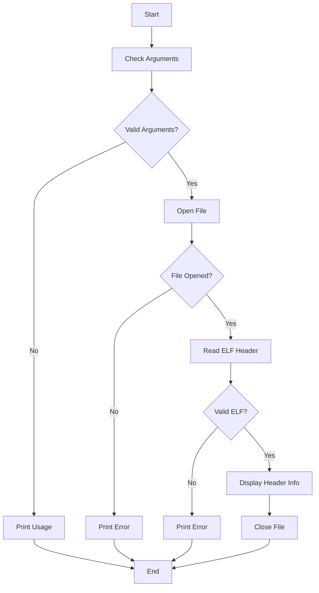

# C - File I/O Project

A project focused on File Input/Output operations in C, including handling ELF files.

## Description

This project explores file operations in C programming using system calls. It includes various functions for file manipulation and a program to analyze ELF (Executable and Linkable Format) files.

## Files Description

* `0-read_textfile.c`: Function that reads a text file and prints it to POSIX standard output
* `1-create_file.c`: Function that creates a file with specific permissions
* `2-append_text_to_file.c`: Function that appends text at the end of a file
* `3-cp.c`: Program that copies the content of a file to another file
* `100-elf_header.c`: Program that displays information from ELF file headers

## Function Prototypes

```c
ssize_t read_textfile(const char *filename, size_t letters);
int create_file(const char *filename, char *text_content);
int append_text_to_file(const char *filename, char *text_content);
```

## ELF Header Program Flowchart



## Technical Information

### Requirements
* All files compiled on Ubuntu 20.04 LTS using gcc
* Compilation flags: `-Wall -Werror -Wextra -pedantic -std=gnu89`
* Code follows Betty style guidelines
* No global variables
* Maximum of 5 functions per file
* Only allowed C standard library functions: `malloc`, `free`, `exit`
* Allowed syscalls: `read`, `write`, `open`, `close`
* All header files are include guarded

### ELF Header Program Features
* Displays ELF header information similar to `readelf -h`
* Shows Magic numbers, Class, Data, Version, OS/ABI, ABI Version, Type, and Entry point
* Handles both 32-bit and 64-bit ELF files
* Proper error handling with status code 98

## Author

* **Frédéric Bourouliou** - [GitHub Profile](https://github.com/fredb219)

## License

This project is part of the Holberton School curriculum.
