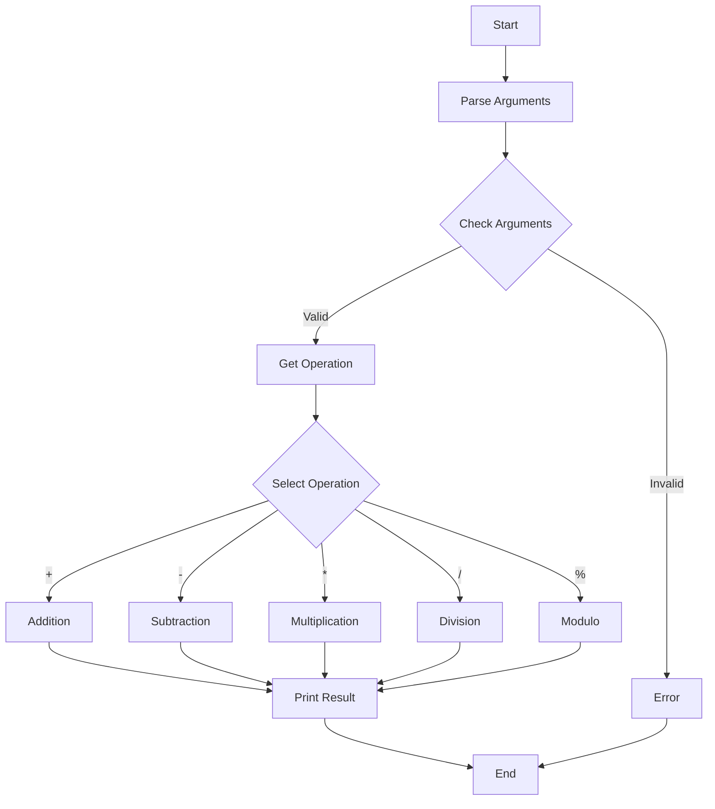

# C - Function Pointers

## Description
This project is part of the Holberton School curriculum and focuses on function pointers in C. It demonstrates various uses of function pointers through different exercises, from basic pointer manipulation to more complex applications like implementing a calculator and analyzing program opcodes.

## Files Description
* `0-print_name.c`: Function that prints a name using a function pointer
* `1-array_iterator.c`: Function that executes a function on each element of an array
* `2-int_index.c`: Function that searches for an integer using a comparison function
* `3-main.c`, `3-op_functions.c`, `3-get_op_func.c`, `3-calc.h`: Calculator program that performs basic operations
* `100-main_opcodes.c`: Program that prints its own opcodes

## Calculator Program
The calculator program consists of several components:
* Main function (`3-main.c`)
* Operation functions (`3-op_functions.c`)
* Operation selector (`3-get_op_func.c`)
* Header file with structures and function prototypes (`3-calc.h`)

## Requirements
* All files are compiled on Ubuntu 20.04 LTS using gcc
* Code follows the Betty style
* No global variables
* Maximum of 5 functions per file
* Only allowed to use `malloc`, `free`, and `exit`
* Allowed to use `_putchar`

## Compilation Examples
```bash
gcc -Wall -pedantic -Werror -Wextra -std=gnu89 0-main.c 0-print_name.c -o a
gcc -Wall -pedantic -Werror -Wextra -std=gnu89 1-main.c 1-array_iterator.c -o b
gcc -Wall -pedantic -Werror -Wextra -std=gnu89 2-main.c 2-int_index.c -o c
gcc -Wall -pedantic -Werror -Wextra -std=gnu89 3-main.c 3-op_functions.c 3-get_op_func.c -o calc
gcc -std=gnu89 100-main_opcodes.c -o main
```

## Flowchart for Calculator Program


## Author
* **Frédéric Bourouliou**
