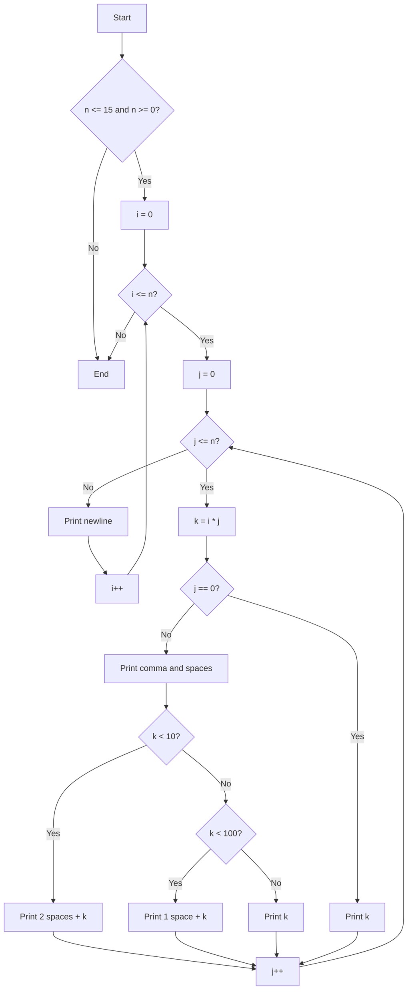
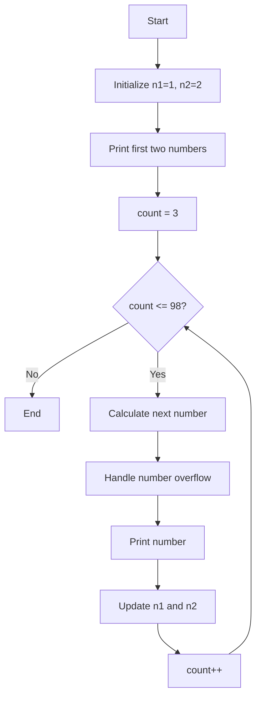

# C - Functions and Nested Loops

This project is part of the low-level programming track at Holberton School. It focuses on understanding and implementing functions and nested loops in C programming language.

## Description

This repository contains various C programs that demonstrate the use of functions, nested loops, and basic C programming concepts. Each file corresponds to a specific task that helps build fundamental programming skills.

## Flowcharts

### Times Table Algorithm (100-times_table.c)


### Fibonacci Sequence (104-fibonacci.c)


## Project Files

### Mandatory Tasks

* `0-putchar.c`: A program that prints "_putchar" followed by a new line
* `1-alphabet.c`: A function that prints the alphabet in lowercase
* `2-print_alphabet_x10.c`: A function that prints the alphabet 10 times
* `3-islower.c`: A function that checks for lowercase characters
* `4-isalpha.c`: A function that checks for alphabetic characters
* `5-sign.c`: A function that prints the sign of a number
* `6-abs.c`: A function that computes the absolute value of an integer
* `7-print_last_digit.c`: A function that prints the last digit of a number
* `8-24_hours.c`: A function that prints every minute of the day
* `9-times_table.c`: A function that prints the 9 times table
* `10-add.c`: A function that adds two integers
* `11-print_to_98.c`: A function that prints all natural numbers from n to 98

### Advanced Tasks

* `100-times_table.c`: A function that prints the n times table, starting with 0
* `101-natural.c`: A program that computes and prints the sum of all multiples of 3 or 5 below 1024
* `102-fibonacci.c`: A program that prints the first 50 Fibonacci numbers
* `103-fibonacci.c`: A program that finds and prints the sum of the even-valued Fibonacci terms under 4,000,000
* `104-fibonacci.c`: A program that prints the first 98 Fibonacci numbers with advanced number handling

## Requirements

* All files are compiled on Ubuntu 20.04 LTS using `gcc`
* Code follows the Betty style
* No global variables are used
* Each file contains no more than 5 functions
* The only C standard library functions allowed are `printf` and `putchar`

## Compilation

To compile the files, use:
```bash
gcc -Wall -Werror -Wextra -pedantic -std=gnu89 *.c -o program_name
```

## Helper Files

* `_putchar.c`: Contains the implementation of the `_putchar` function
* `main.h`: Header file containing all function prototypes

## Author

Frédéric Bourouliou

## License

This project is part of the curriculum of Holberton School.
