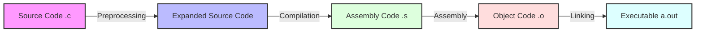

# C - Hello, World

A collection of C programming exercises focusing on the basics of compilation process and fundamental C programming concepts.

## Author
* **Frédéric Bourouliou**

## Project Overview
This project contains various exercises that demonstrate the C compilation process and basic C programming concepts. Each file serves a specific purpose in understanding how C programs are compiled and executed.

## Files Description

### Compilation Process Scripts
* `0-preprocessor` - Script that runs a C file through the preprocessor
* `1-compiler` - Script that compiles a C file but does not link
* `2-assembler` - Script that generates the assembly code of a C code
* `3-name` - Script that compiles a C file and creates an executable named `cisfun`
* `100-intel` - Script that generates the assembly code (Intel syntax) of a C code

### C Programs
* `4-puts.c` - C program that prints a specific string using the `puts` function
* `5-printf.c` - C program that prints a specific string using the `printf` function
* `6-size.c` - C program that prints the size of various types
* `101-quote.c` - C program that prints to the standard error

## Project Structure
```
.
├── 0-preprocessor
├── 1-compiler
├── 2-assembler
├── 3-name
├── 4-puts.c
├── 5-printf.c
├── 6-size.c
├── 100-intel
└── 101-quote.c
```

## Learning Objectives
* Understanding the C compilation process
* Learning basic C programming concepts
* Working with standard input/output functions
* Understanding different data types in C

## Requirements
* All programs are compiled on Ubuntu 20.04 LTS using `gcc`
* All files should end with a new line
* A `README.md` file at the root of the folder
* No errors and no warnings during compilation
* Not allowed to use `system`
* Code should use the Betty style

## Compilation
All C files can be compiled using gcc:
```bash
gcc -Wall -Werror -Wextra -pedantic <filename.c>
```

## C Compilation Process Flowchart


