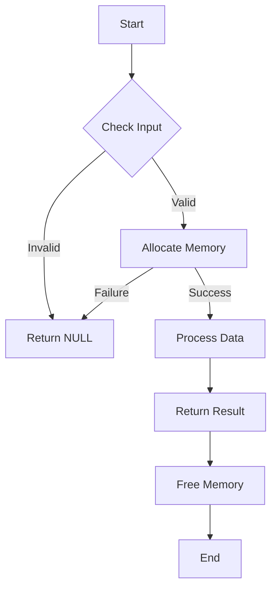

# C - malloc, free

A project focused on dynamic memory allocation in C programming language.

## Description

This project explores the concepts of dynamic memory allocation in C using `malloc` and `free`. It contains various functions that demonstrate memory allocation, string manipulation, and 2D array handling.

## Functions

* `_putchar.c`: Custom function to print characters
* `create_array`: Creates an array of chars and initializes it
* `_strdup`: Returns a pointer to a newly allocated space in memory containing a copy of a string
* `str_concat`: Concatenates two strings
* `alloc_grid`: Returns a pointer to a 2D array of integers
* `free_grid`: Frees a 2D grid previously created
* `argstostr`: Concatenates all arguments of a program
* `strtow`: Splits a string into words

## Memory Management Flowchart



## Requirements

* All files are compiled on Ubuntu 20.04 LTS using gcc
* Code uses the Betty style
* No global variables
* Maximum of 5 functions per file
* Only allowed functions: malloc, free, and exit
* You are not allowed to use static variables

## Compilation

```bash
gcc -Wall -Werror -Wextra -pedantic -std=gnu89 *.c -o program
```

## Author

* **Frédéric Bourouliou** 

## Files Structure

* `main.h` - Header file containing all function prototypes
* `0-create_array.c` - Function that creates an array of chars
* `1-strdup.c` - Function that duplicates a string
* `2-str_concat.c` - Function that concatenates two strings
* `3-alloc_grid.c` - Function that creates a 2D array
* `4-free_grid.c` - Function that frees a 2D grid
* `100-argstostr.c` - Function that concatenates program arguments
* `101-strtow.c` - Function that splits a string into words

## Return Values

* Most functions return NULL on failure
* Memory is properly freed when allocation fails
* All functions handle edge cases (NULL inputs, zero sizes, etc.)
