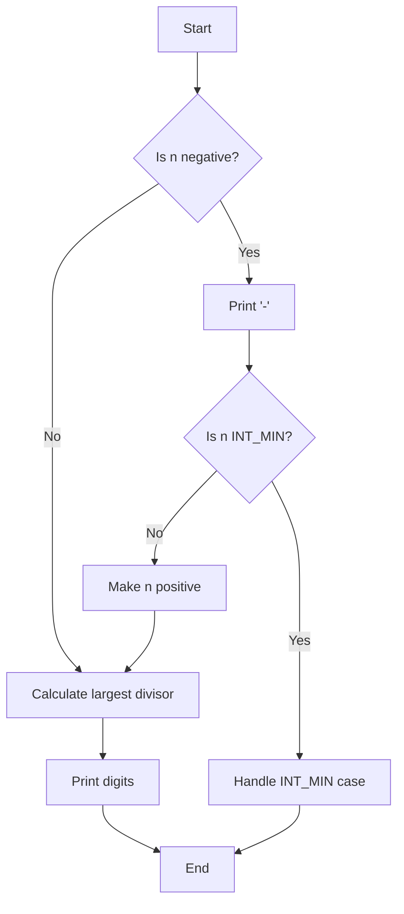

# C - More functions, more nested loops

## Description
This project contains C programming exercises focusing on functions and nested loops. Each file demonstrates different aspects of C programming, from basic character checks to complex number operations.

## Author
* Frédéric Bourouliou

## Files Description

### 0-isupper.c
* Function that checks for uppercase character
* Returns 1 if c is uppercase
* Returns 0 otherwise

### 1-isdigit.c
* Function that checks for a digit (0 through 9)
* Returns 1 if c is a digit
* Returns 0 otherwise

### 2-mul.c
* Function that multiplies two integers
* Returns the result of the multiplication

### 3-print_numbers.c
* Function that prints the numbers from 0 to 9
* Uses _putchar function
* Followed by a new line

### 4-print_most_numbers.c
* Function that prints numbers from 0 to 9
* Does not print 2 and 4
* Uses _putchar function
* Followed by a new line

### 5-more_numbers.c
* Function that prints 10 times the numbers from 0 to 14
* Uses _putchar function
* Followed by a new line

### 6-print_line.c
* Function that draws a straight line in the terminal
* Uses _putchar function to print underscore character
* Line ends with a new line
* If n is 0 or less, only prints new line

### 7-print_diagonal.c
* Function that draws a diagonal line in the terminal
* Uses _putchar function to print backslash character
* Diagonal ends with a new line
* If n is 0 or less, only prints new line

### 8-print_square.c
* Function that prints a square using #
* Size determines the square's dimensions
* Followed by a new line
* If size is 0 or less, only prints new line

### 9-fizz_buzz.c
* Program that prints numbers from 1 to 100
* For multiples of 3, prints "Fizz"
* For multiples of 5, prints "Buzz"
* For multiples of both 3 and 5, prints "FizzBuzz"
* Each number or word is separated by a space

### 10-print_triangle.c
* Function that prints a triangle using #
* Size parameter determines triangle size
* Followed by a new line
* If size is 0 or less, only prints new line

### 100-prime_factor.c
* Program that finds and prints the largest prime factor of 612852475143
* Uses standard library
* Implements efficient algorithm for prime factorization
* Handles large numbers effectively

### 101-print_number.c
* Function that prints an integer with specific constraints
* Uses only _putchar function to print
* No use of long data type
* No arrays or pointers
* Handles negative numbers and special cases (including INT_MIN)

## Flowchart for print_number function


## Compilation
All files are compiled on Ubuntu 20.04 LTS using:
```bash
gcc -Wall -pedantic -Werror -Wextra -std=gnu89
```

## Requirements
* All files are written in C
* Code follows the Betty style
* No global variables
* Limited number of functions per file
* Allowed editors: vi, vim, emacs
