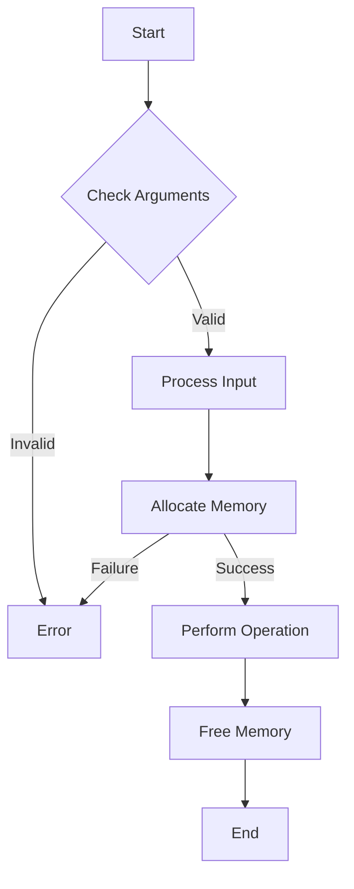

# C - More malloc, free

This project is part of the Holberton School curriculum. It focuses on memory allocation in C, specifically using malloc, free, and other memory management functions.

## Author
* **Frédéric Bourouliou**

## Project Description
This project contains several functions that demonstrate advanced memory allocation techniques in C:

### Functions
* `malloc_checked` - Allocates memory using malloc with error checking
* `string_nconcat` - Concatenates two strings with a limit on the second string
* `_calloc` - Allocates memory for an array using malloc and initializes it to zero
* `array_range` - Creates an array of integers containing values from min to max
* `_realloc` - Reallocates a memory block using malloc and free
* `multiply` (Advanced) - Multiplies two positive numbers of any size

## Function Flowchart


## Technical Information

### Requirements
* All files are compiled on Ubuntu 20.04 LTS
* Compiled with gcc using flags: -Wall -Werror -Wextra -pedantic -std=gnu89
* Code follows the Betty style

### Files Description
* `0-malloc_checked.c`: Function that allocates memory using malloc
* `1-string_nconcat.c`: Function that concatenates two strings
* `2-calloc.c`: Function that allocates memory for an array using malloc
* `3-array_range.c`: Function that creates an array of integers
* `100-realloc.c`: Function that reallocates a memory block
* `101-mul.c`: Program that multiplies two positive numbers

### Memory Management
* All allocated memory is properly freed
* No memory leaks
* Error checking for malloc failures

## Usage Examples
```c
/* Example for malloc_checked */
int *p = malloc_checked(sizeof(int) * 10);

/* Example for string_nconcat */
char *s = string_nconcat("Hello ", "World", 3); // Returns "Hello Wor"

/* Example for multiply (101-mul.c) */
./101-mul 123 456  // Outputs: 56088
```

## Compilation
All files can be compiled using:
```bash
gcc -Wall -Werror -Wextra -pedantic -std=gnu89 *.c -o program_name
```
