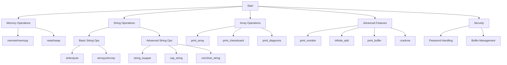

# C - Pointers, Arrays and Strings

This repository contains C programs that demonstrate the use of pointers, arrays, and string manipulation in C programming language.

## Author
* **Frédéric Bourouliou**

## Project Overview
This project covers fundamental concepts in C programming:
* Pointers and memory manipulation
* Array operations
* String handling functions
* Memory management with functions like `memset` and `memcpy`
* Advanced pointer manipulation and string operations

## Files Description

### Memory Functions
* `0-reset_to_98.c` - Function that takes a pointer to an int and updates its value to 98
* `0-memset.c` - Function that fills memory with a constant byte
* `1-memcpy.c` - Function that copies memory area
* `1-swap.c` - Function that swaps the values of two integers

### String Manipulation
* `2-strlen.c` - Function that returns the length of a string
* `2-strncpy.c` - Function that copies a string with a specified number of bytes
* `3-puts.c` - Function that prints a string to stdout
* `3-strcmp.c` - Function that compares two strings
* `4-print_rev.c` - Function that prints a string in reverse
* `4-rev_array.c` - Function that reverses the content of an array of integers
* `5-rev_string.c` - Function that reverses a string
* `5-string_toupper.c` - Function that changes all lowercase letters to uppercase
* `6-cap_string.c` - Function that capitalizes all words of a string
* `6-puts2.c` - Function that prints every other character of a string

### String Search and Analysis
* `2-strchr.c` - Function that locates a character in a string
* `3-strspn.c` - Function that gets the length of a prefix substring
* `4-strpbrk.c` - Function that searches a string for any of a set of bytes
* `5-strstr.c` - Function that locates a substring
* `7-leet.c` - Function that encodes a string into 1337

### Array and Matrix Operations
* `7-print_chessboard.c` - Function that prints a chessboard
* `8-print_array.c` - Function that prints n elements of an array of integers
* `8-print_diagsums.c` - Function that prints the sum of two diagonals of a square matrix
* `9-strcpy.c` - Function that copies a string

### Advanced Functions
* `100-rot13.c` - Function that encodes a string using ROT13 cipher (replaces each letter with the 13th letter after it)
* `100-set_string.c` - Function that sets the value of a pointer to a char (double pointer manipulation)
* `101-print_number.c` - Function that prints an integer using only _putchar (no arrays, pointers, or hard-coded special values)
* `101-crackme_password` - File containing password for crackme2 executable (no newline)
* `102-magic.c` - Program demonstrating pointer arithmetic and memory manipulation
* `103-infinite_add.c` - Function that adds two numbers of any size stored as strings
* `104-print_buffer.c` - Function that prints a buffer with hexadecimal and ASCII representation

### Support Files
* `main.h` - Header file containing all function prototypes
* `_putchar.c` - Function that writes a character to stdout
* Various test files (`*-main.c`) - Files containing test cases for each function

## Requirements
* All files are compiled on Ubuntu LTS using `gcc`
* Code follows the Betty style
* No global variables are used
* Each file contains no more than 5 functions
* Only standard library functions allowed are `malloc`, `free`, and `exit`
* Allowed syscalls: `read`, `write`, `open`, `close`

## Compilation
All files can be compiled using:
```bash
gcc -Wall -Werror -Wextra -pedantic -std=gnu89 *.c
```

## Flowchart

