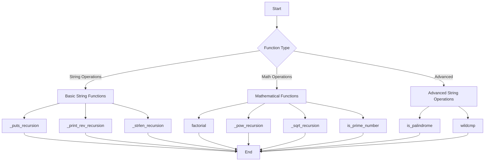

# C - Recursion

This project explores the concept of recursion in C programming through a series of increasingly complex functions. Each function demonstrates different aspects of recursive programming, from basic string manipulation to advanced pattern matching.

## Author
* **Frédéric Bourouliou**

## Project Overview

This repository contains various C functions that implement recursive solutions for different problems:

### Basic Functions
* `_putchar.c` - Writes a character to stdout
* `_puts_recursion` - Prints a string using recursion
* `_print_rev_recursion` - Prints a string in reverse using recursion
* `_strlen_recursion` - Returns the length of a string using recursion

### Mathematical Functions
* `factorial` - Returns the factorial of a given number
* `_pow_recursion` - Returns the value of x raised to the power of y
* `_sqrt_recursion` - Returns the natural square root of a number
* `is_prime_number` - Determines if an integer is prime

### Advanced String Operations
* `is_palindrome` - Checks if a string is a palindrome
* `wildcmp` - Compares two strings where one can contain the wildcard character *

## Function Flowchart



## Technical Details

### Compilation
All files are compiled on Ubuntu 20.04 LTS using:
```bash
gcc -Wall -Werror -Wextra -pedantic -std=gnu89
```

### Files Structure
* `main.h` - Contains all function prototypes
* `*-main.c` - Test files for each function
* `*.c` - Implementation files

## Requirements
* All files are written in C
* No global variables used
* No standard library functions used except `_putchar`
* Code follows the Betty style

## Advanced Features
* Implementation of wildcard character (*) matching in string comparison
* Recursive palindrome checking
* Efficient prime number detection
* Natural square root calculation without using standard math functions
