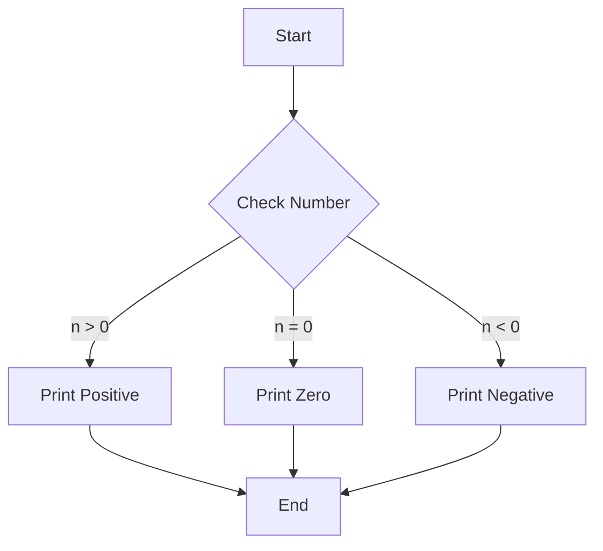

# C - Variables, if, else, while

A collection of C programs demonstrating the use of variables, conditional statements, and loops.

## Author
* Frédéric Bourouliou

## Project Description
This project contains various C programs that explore fundamental programming concepts including:
* Variables and data types
* Conditional statements (if/else)
* Loops (while)
* ASCII character manipulation
* Number combinations and patterns

## Files Description

* `0-positive_or_negative.c`: Program that determines if a random number is positive, negative, or zero
* `1-last_digit.c`: Program that prints the last digit of a random number
* `2-print_alphabet.c`: Program that prints the alphabet in lowercase
* `3-print_alphabets.c`: Program that prints the alphabet in lowercase, then uppercase
* `4-print_alphabt.c`: Program that prints the alphabet in lowercase except 'q' and 'e'
* `5-print_numbers.c`: Program that prints single digit numbers
* `6-print_numberz.c`: Program that prints single digit numbers using putchar
* `7-print_tebahpla.c`: Program that prints the lowercase alphabet in reverse
* `8-print_base16.c`: Program that prints all numbers of base 16 in lowercase
* `9-print_comb.c`: Program that prints all possible combinations of single-digit numbers
* `100-print_comb3.c`: Program that prints all possible different combinations of two digits
* `101-print_comb4.c`: Program that prints all possible different combinations of three digits
* `102-print_comb5.c`: Program that prints all possible combinations of two two-digit numbers

## Requirements
* All programs are compiled on Ubuntu 20.04 LTS using `gcc`
* Code follows the Betty style
* No global variables allowed
* No more than 5 functions per file
* Only allowed C standard library functions are: `printf`, `putchar`, `srand`, `rand`, `time`
* All function prototypes should be included in a header file called `main.h`

## Compilation
All files can be compiled using:
```bash
gcc -Wall -Werror -Wextra -pedantic -std=gnu89 [filename.c] -o [output]
```

## Flowchart


This flowchart represents the basic logic flow of the `0-positive_or_negative.c` program, which is a fundamental example of conditional statements in this project.
